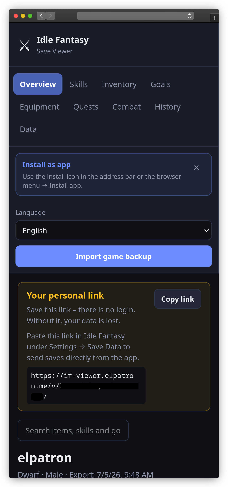
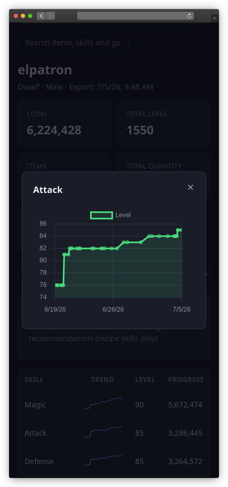
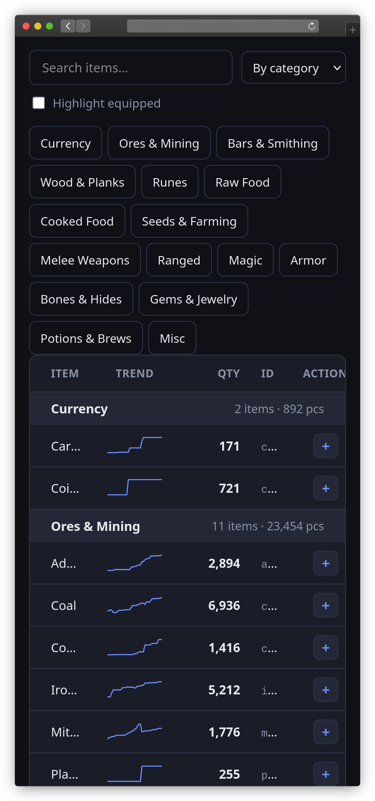
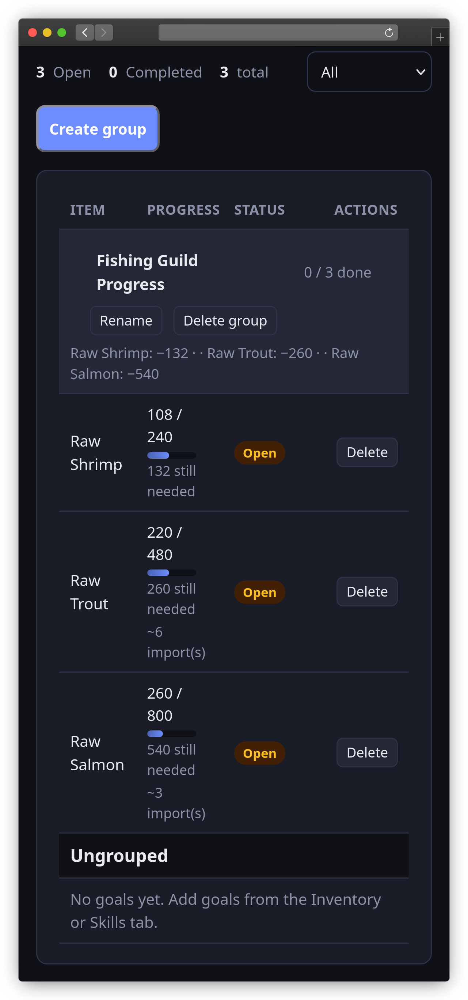
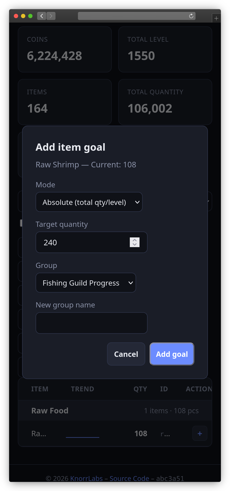
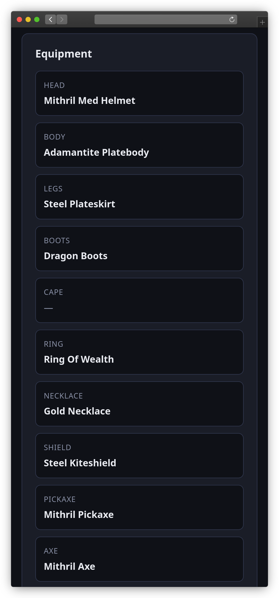
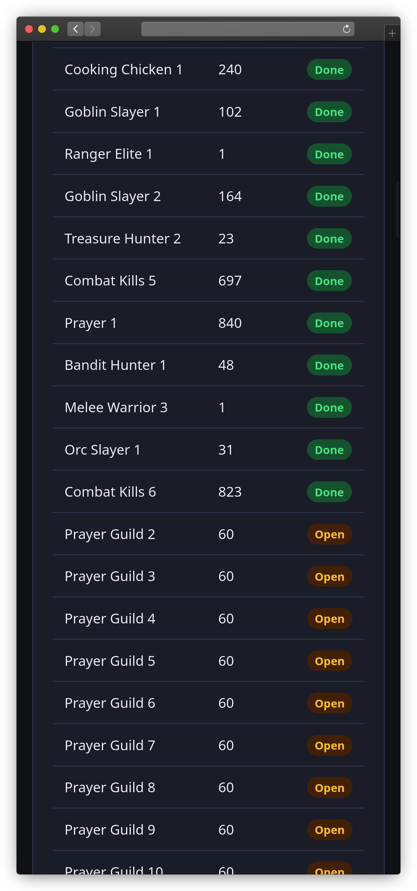
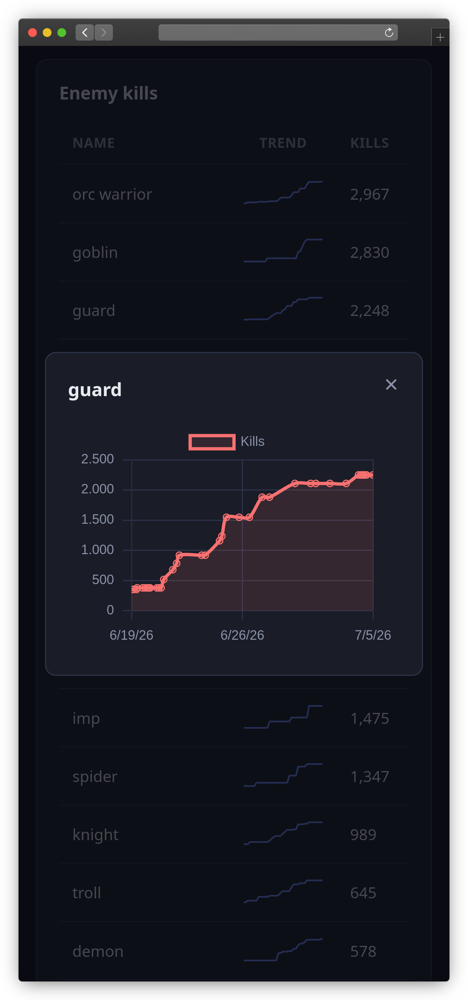
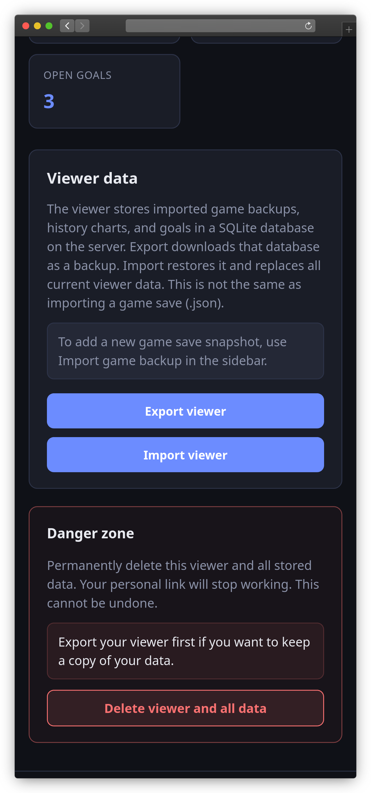

# Idle Fantasy Save Viewer

A web viewer for backups of the Android game **[Idle Fantasy](https://github.com/tristinbaker/IdleFantasy)**. Parses `fantasyidler_save.json` and displays skills, inventory, quests, combat, housing, prestige talent trees, and seasonal events in a dark dashboard — with filters, item grouping, snapshot history in SQLite, **trend sparklines**, and a **training advisor** powered by vendored game recipe data.

**[Live demo](https://if-viewer.elpatron.me/)** — try the viewer in your browser (create a personal link, no account required).

## Screenshots

Gallery for the [live demo](https://if-viewer.elpatron.me/). Thumbnails below link to expandable sections with full-size images.  
*(GitHub README: HTML `<details>` and `` are supported; JavaScript slideshows are not.)*

<table>
<tr>
<td align="center"><a href="#screenshot-overview"></a><br><strong>Overview</strong></td>
<td align="center"><a href="#screenshot-skills"></a><br><strong>Skills</strong></td>
<td align="center"><a href="#screenshot-inventory"></a><br><strong>Inventory</strong></td>
</tr>
<tr>
<td align="center"><a href="#screenshot-goals"></a><br><strong>Goals</strong></td>
<td align="center"><a href="#screenshot-add-goal"></a><br><strong>Add goal</strong></td>
<td align="center"><a href="#screenshot-equipment"></a><br><strong>Equipment</strong></td>
</tr>
<tr>
<td align="center"><a href="#screenshot-quests"></a><br><strong>Quests</strong></td>
<td align="center"><a href="#screenshot-combat"></a><br><strong>Combat</strong></td>
<td align="center"><a href="#screenshot-history"></a><br><strong>History</strong></td>
</tr>
<tr>
<td align="center" colspan="3"><a href="#screenshot-data"></a><br><strong>Data</strong> (export / import / delete viewer)</td>
</tr>
</table>

**Also available (no gallery screenshot yet):** [House](#house), [Prestige](#prestige), [Events](#events) tabs.

<a name="screenshot-overview"></a>
<details>
<summary><strong>Overview</strong> — character header, KPIs, import summary</summary>
<p></p>
</details>

<a name="screenshot-skills"></a>
<details>
<summary><strong>Skills</strong> — level/XP table, sparklines, training advisor</summary>
<p></p>
</details>

<a name="screenshot-inventory"></a>
<details>
<summary><strong>Inventory</strong> — search, filters, grouped items, quantity trends</summary>
<p></p>
</details>

<a name="screenshot-goals"></a>
<details>
<summary><strong>Goals</strong> — grouped targets, progress, status</summary>
<p></p>
</details>

<a name="screenshot-add-goal"></a>
<details>
<summary><strong>Add goal</strong> — create item goal from inventory</summary>
<p></p>
</details>

<a name="screenshot-equipment"></a>
<details>
<summary><strong>Equipment</strong> — equipped gear by slot</summary>
<p></p>
</details>

<a name="screenshot-quests"></a>
<details>
<summary><strong>Quests</strong> — story, daily, weekly, and guild progress</summary>
<p></p>
</details>

<a name="screenshot-combat"></a>
<details>
<summary><strong>Combat</strong> — kills, dungeons, recent activity</summary>
<p></p>
</details>

<a name="screenshot-history"></a>
<details>
<summary><strong>History</strong> — charts and snapshot comparison</summary>
<p></p>
</details>

<a name="screenshot-data"></a>
<details>
<summary><strong>Data</strong> — viewer backup export/import and danger zone</summary>
<p></p>
</details>

## Features

- **Overview** — character, KPIs, session queue, slayer, pets, farming, guild reputation, monument, tower, workers, titles, town buildings, import summary
- **Skills** — sortable table with level/XP progress, prestige stars, per-skill level sparklines, and **training advisor** (XP/min rankings from recipe data)
- **Prestige** — talent trees for all skills with purchased nodes, unspent points, auto XP paths, and active bonus summary
- **Inventory** — text search, category filters, sorting, grouped tables, equipped-item highlighting, quantity sparklines (click to enlarge)
- **Goals** — item and skill targets in groups (absolute or relative), progress/ETA, completion on import; **one-click goals** from the training advisor
- **Equipment** — equipped gear by slot and per-style armor loadouts (attack, strength, ranged, magic)
- **House** — floor plan grid, rooms, furnishings, storage, editor draft, and saved blueprints
- **Quests** — story, daily, weekly, and guild quest lists with open/done filters
- **Combat** — kills, dungeon runs, last-run stats, expeditions, **combat loadout** (food preset, style presets, boss coins), recent activity, active sessions
- **Events** — seasonal bounties/tokens/minigame and carnival cooldowns
- **History** — coins and total level over time, top-skills chart, snapshot comparison (inventory/skill deltas), delete snapshots
- **Data** — export/import the viewer SQLite database (snapshots, history, goals) or delete the viewer
- **Global search** across items, skills, goals, and house furnishings; deep links to tabs (`#overview`, `#house`, `#prestige`, …)
- **Viewer backup** — export/import the viewer SQLite database (snapshots, history, goals)
- **Import** via CLI or browser upload
- **Multi-user** without login — each player gets their own viewer via a secret link
- **PWA** — install hint and per-viewer service worker for home-screen / standalone use
- **Docker** — ready to run behind nginx Proxy Manager (includes container health check)
- **i18n** — English as default/fallback, German optional; automatic browser language or manual selection in the sidebar

## Android integration

Upload saves directly from the **[Idle Fantasy Android app](https://github.com/elpatron68/IdleFantasyApp)** (Settings → Save Data):

1. Create a viewer on the [live instance](https://if-viewer.elpatron.me/) or your self-hosted URL → **Copy link**
2. Paste the link into **Save Viewer URL** in the app settings
3. Tap **Send to Save Viewer** — the app POSTs your export JSON to `POST /v/<viewer_id>/api/import` (multipart field `file`)

The viewer URL is stored locally in the game save; no account is required. For local development, clone both repos side by side (see [Repository layout](#repository-layout)).

## Requirements

- Python 3.11+
- An Idle Fantasy backup (`fantasyidler_save.json` from the in-game export)

## Installation

### Windows (PowerShell)

```powershell
python -m venv .venv
.\.venv\Scripts\Activate.ps1
pip install -r requirements.txt
```

### WSL (recommended for deploy)

Keep the repo on the Linux filesystem (not `/mnt/c/`) to avoid CRLF/git/deploy issues between Windows and WSL:

```bash
# one-time clone or copy to e.g. ~/source/idle-fantasy-viewer
cd ~/source/idle-fantasy-viewer
python3 -m venv .venv
source .venv/bin/activate
pip install -r requirements.txt
```

Open in **Cursor**: *File → Open Folder in WSL…* → `~/source/idle-fantasy-viewer`  
Windows path (Explorer): `\\wsl.localhost\Ubuntu-24.04\home\markus\source\idle-fantasy-viewer`

Run tests, dev server, and `bash scripts/deploy.sh` from the same WSL shell.

## Usage

### Start server and import a backup

```powershell
python app.py fantasyidler_save.json
```

The browser opens automatically at your personal viewer URL (e.g. `http://127.0.0.1:5000/v/<id>/`). The id is stored in `data/cli-viewer-id` and reused on the next start.

### Docker (host for other players)

Runs behind **nginx Proxy Manager**. By default the container publishes port **5000** on the host so NPM can forward to `http://<docker-host>:5000` (e.g. `http://172.16.10.20:5000`).

```powershell
docker compose up -d --build
```

1. In NPM: Proxy Host → `http://<docker-host-ip>:5000`, enable SSL, Force SSL.
2. Open your public URL → **Create my viewer**
3. Save the personal link (bookmark) — **without the link, data cannot be recovered** (no login)
4. Import backups in the browser

**Alternative:** If NPM runs on the **same Docker host**, you can remove the `ports` mapping, attach the `viewer` service to the NPM network (see `docker-compose.yml` comments), and proxy to `http://viewer:5000` instead.

Data is stored in the Docker volume `viewer-data` (`/data/viewers/<id>.db`).

```powershell
# Logs
docker compose logs -f

# Stop
docker compose down
```

### Deploy to production

#### Local (manual)

For a git-based rollout to a remote Docker host (push → pull → `docker compose up --build` → wait for health check):

```bash
bash scripts/deploy.sh
```

Configure via environment variables: `DEPLOY_HOST` (default `root@10.0.0.5`), `DEPLOY_DIR`, `DEPLOY_SERVICE`, `DEPLOY_HEALTH_RETRIES`, `DEPLOY_HEALTH_INTERVAL`. Requires a clean working tree, an upstream branch, and SSH access. The remote script lives in `scripts/deploy-remote.sh`.

#### GitHub Actions (WireGuard → Proxmox LXC)

Workflow [`.github/workflows/deploy.yml`](.github/workflows/deploy.yml) deploys on every push to `master` and via **Actions → Deploy → Run workflow**:

1. Runs smoke tests
2. Installs `wireguard-tools` / `iproute2` on the GitHub-hosted runner
3. Brings up WireGuard (`DEPLOY_WG_CONF`), SSHs to the LXC, tears the tunnel down
4. On the LXC: `scripts/deploy-remote.sh` (set origin to GitHub → fetch → `docker compose up --build` → health check)

GitHub-hosted runners are not on the LAN, so `DEPLOY_WG_CONF` is **required**. `DNS=` lines in the config are stripped automatically (`resolvconf` is missing in CI).

**GitHub repository secrets** (Settings → Secrets and variables → Actions):

| Secret | Required | Example / notes |
|--------|----------|-----------------|
| `DEPLOY_SSH_KEY` | yes | Private SSH key — prefer **one-line Base64** (`base64 -w0 deploy_ed25519`); PEM also works |
| `DEPLOY_HOST` | yes | LXC WireGuard/LAN address, e.g. `10.66.0.10` or `root@10.66.0.10` |
| `DEPLOY_DIR` | yes | `/opt/apps/Idle-Fantasy-Save-Viewer` |
| `DEPLOY_WG_CONF` | yes | Full `wg-quick` config for a dedicated CI peer |
| `DEPLOY_USER` | no | SSH user if `DEPLOY_HOST` has no `user@` (default `root`) |
| `DEPLOY_SERVICE` | no | Compose service name (default `viewer`) |
| `DEPLOY_BRANCH` | no | Branch to deploy (default `master`) |
| `DEPLOY_SSH_PORT` | no | SSH port (default `22`) |
| `DEPLOY_HEALTH_RETRIES` | no | Default `30` |
| `DEPLOY_HEALTH_INTERVAL` | no | Seconds between polls (default `2`) |
| `DEPLOY_SSH_KNOWN_HOSTS` | no | `known_hosts` lines; if unset, `accept-new` is used |
| `DEPLOY_GIT_REMOTE` | no | Origin URL on the LXC (default GitHub HTTPS) |
| `AUTO_DEPLOY` | no | Set to `false` to skip deploy after upstream game_data sync |

Example `DEPLOY_WG_CONF` (`DNS=` is stripped automatically):

```ini
[Interface]
PrivateKey = <runner-peer-private-key>
Address = 10.66.0.2/32

[Peer]
PublicKey = <server-public-key>
AllowedIPs = 10.66.0.0/24
Endpoint = <vpn-host>:51820
PersistentKeepalive = 25
```

On the LXC: clone the repo into `DEPLOY_DIR`, install Docker Compose, and authorize the deploy public key for `DEPLOY_HOST`.

Upstream sync (`.github/workflows/sync-upstream.yml`) runs daily (and on `workflow_dispatch`), pulls recipe JSON from the Idle Fantasy repo, runs smoke tests, commits `game_data/` when changed, then reuses the same WireGuard deploy. Deploy uses `git rev-parse HEAD` after the sync push (not the pre-sync checkout SHA).

### More options

```powershell
# Import only, no server
python app.py --import backup2.json

# Different port, don't open browser
python app.py fantasyidler_save.json --port 8080 --no-browser

# Custom SQLite database (legacy single-file mode)
python app.py --db data\my_history.db fantasyidler_save.json

# Bind server for network/Docker
python app.py --host 0.0.0.0 --no-browser
```

### Import backups in the browser

Sidebar at the bottom: **Import backup** — selects a `.json` file. Duplicates (same file hash) are skipped. After a successful import, a summary card on the overview tab shows changes compared to the previous snapshot.

Import multiple backups over time to unlock **trend charts** (sparklines appear from the second snapshot onward).

### Trend charts

Per-item, per-skill, and per-combat-entry mini charts in the **Inventory**, **Skills**, and **Combat** tabs:

- Sparkline in the **Trend** column when at least two snapshots exist and the value changed at least twice
- Click a sparkline to open a larger Chart.js modal with the full time series
- **History** tab: aggregate charts for coins, total level, and top skills over time; pick two snapshots to compare inventory and skill deltas

Timeline data is derived from stored snapshots (`/api/inventory/timeline`, `/api/skills/timeline`, `/api/combat/timeline`).

### Training advisor

On the **Skills** tab, click a skill row to load **training recommendations** (recipe-based crafting skills):

- Ranks unlocked activities by **XP per minute**, checks materials against your current inventory, and estimates time to the next level
- Supported skills: smithing, crafting, cooking, fletching, herblore, construction (from vendored game data)
- **Level as goal** — button to create an absolute skill goal for the next level
- **+ per row** — create a relative item goal (craft count until next level for that activity)

Recipe JSON is synced from the [Idle Fantasy](https://github.com/tristinbaker/IdleFantasy) open-source repo (`app/src/main/assets/data/recipes/`). See `game_data/ATTRIBUTION.md`. Refresh with:

```bash
python scripts/sync_game_data.py
```

House tile metadata (`game_data/house_tiles.json`) and prestige paths (`game_data/prestige_paths.json`) are vendored separately from the same upstream repo (see `game_data/ATTRIBUTION.md`).

API: `GET /v/<id>/api/advisor/<skill_key>` (uses latest snapshot + `game_data/recipes/`).

### Combat

The **Combat** tab shows:

- **Combat loadout** — food preset and eat threshold, magic/ranged/arrow/rune presets, boss coin progress, active boss/dungeon repeat runs
- **Enemy kills** and **dungeon runs** — sorted tables with kill/run counts and optional trend sparklines
- **Last dungeon runs** — food consumed, kills, survived per dungeon
- **Expeditions** — unlocked skilling dungeons, notes, pity counters
- **Recent activity** and **active sessions** from the latest save

Slayer task and foretold tasks appear on the **Overview** tab when present in the save.

### House

The **House** tab (player housing from recent game updates) shows:

- Summary — room count, ground type, placements, stored furnishings
- **Floor plan** — 18×18 grid with rooms and placed items (schematic, not in-game sprites)
- Tables for rooms and furnishings; storage list for built-but-unplaced items
- **Editor draft** when an unpurchased layout exists in the save
- **Saved blueprints** (up to three slots)

Data comes from `flags.house`, `flags.house_draft`, and `flags.house_blueprints`. Item names use vendored `game_data/house_tiles.json`.

### Prestige

The **Prestige** tab shows per-skill talent progress when the save has prestige activity:

- Prestige count, points earned/spent/unspent, and point cap
- **Talent tree paths** with node status (owned, buyable, locked, race-locked, auto XP tiers)
- **Active bonuses** aggregated from purchased and auto nodes

Uses `flags.skill_prestige`, `flags.prestige_points_earned`, `flags.prestige_nodes`, and vendored `game_data/prestige_paths.json`. Prestige stars on the **Skills** tab reflect `skill_prestige` only.

### Events

The **Events** tab covers:

- **Seasonal events** — tokens, minigame cooldown, banners, bounty slots/progress
- **Carnival** — skill level, tickets (from inventory), minigame cooldowns, difficulties

### Goals

Create targets from the **Inventory** or **Skills** tab (+ button per row), from the **training advisor**, or manage them under **Goals**:

- **Item goals** — absolute (reach total quantity) or relative (gain since creation)
- **Skill goals** — target level, absolute or relative
- **Groups** — organize goals, rename groups, clear completed entries
- **Progress** — missing quantity, ETA based on import history (items), completion banner on import
- Open goals are marked with 🎯 in inventory and skills tables

### Navigation

Sidebar tabs (URL hashes for bookmarking):

| Tab | Hash | Focus |
|-----|------|--------|
| Overview | `#overview` | Character summary, import changes |
| Skills | `#skills` | Levels, advisor |
| Prestige | `#prestige` | Talent trees |
| Inventory | `#inventory` | Items, categories |
| Goals | `#goals` | Targets |
| Equipment | `#equipment` | Gear and loadouts |
| House | `#house` | Floor plan |
| Quests | `#quests` | Story / daily / weekly / guild |
| Combat | `#combat` | Kills, loadout, expeditions |
| Events | `#events` | Seasonal, carnival |
| History | `#history` | Charts, compare |
| Data | `#backup` | Viewer `.db` export/import |

Example: `http://127.0.0.1:5000/v/<id>/#house`. The global search field above the KPI row jumps to matching items, skills, goals, or house furnishings.

### Export / import viewer database

The sidebar section **Viewer backup** is separate from **Import backup** (game `.json`):

| Action | File | Effect |
|--------|------|--------|
| **Import backup** | `.json` from Idle Fantasy | Adds a new snapshot to the current viewer |
| **Export viewer** | `.db` download | Full backup of snapshots, history, and goals |
| **Import viewer** | `.db` from a previous export | **Replaces** all data in the current viewer |

Use export/import to move your history and goals to another machine, keep an offline backup, or recover after data loss — as long as you still have your personal viewer link (or use the same viewer id locally).

The `.db` file contains all stored save data; treat it as private. Import asks for confirmation because it overwrites the current viewer database.

## Multi-user (no login)

Each viewer has its own SQLite database at `data/viewers/<viewer_id>.db`.

| Route | Description |
|-------|-------------|
| `GET /` | Landing page — create a new viewer |
| `POST /api/viewers` | Creates a viewer, returns `{ viewer_id, url }` |
| `GET /v/<viewer_id>/` | Personal dashboard |
| `GET /v/<viewer_id>/api/...` | API for this viewer |

The `viewer_id` is a random URL-safe token. Anyone with the link has access — there is no password and no recovery if the link is lost.

Local CLI usage creates a persistent personal viewer (`data/cli-viewer-id`). Use `--viewer local` for the shared dev viewer at `/v/local/`. In Docker/production, `/v/local/` is disabled (`DISABLE_LOCAL_VIEWER=1`).

## Security

The app uses **secret-link access** (no accounts). Suitable for sharing with trusted players when deployed behind HTTPS.

### Built-in protections

| Measure | Default (Docker) |
|---------|------------------|
| Upload size limit | 10 MB (`MAX_UPLOAD_MB`) |
| Viewer creation rate limit | 5 / minute per IP |
| Import rate limit | 20 / hour per IP |
| Path-based import | **Removed** (upload only) |
| `/v/local/` in production | Disabled |
| Reverse-proxy headers | `TRUST_PROXY=1` (ProxyFix) |
| HTTPS links | `PREFERRED_URL_SCHEME=https` |
| Security headers | CSP, `X-Frame-Options`, `nosniff`, `Referrer-Policy` |
| Chart.js | Bundled locally (no CDN) |
| Container user | Non-root (`appuser`, uid 1000) |

### Environment variables

| Variable | Default | Description |
|----------|---------|-------------|
| `DATA_DIR` | `./data` | SQLite and upload storage |
| `TRUST_PROXY` | `1` in Docker | Trust `X-Forwarded-*` from nginx |
| `PREFERRED_URL_SCHEME` | `https` in Docker | Scheme for generated viewer URLs |
| `DISABLE_LOCAL_VIEWER` | `1` in Docker | Block predictable `/v/local/` |
| `MAX_UPLOAD_MB` | `10` | Max upload body size |
| `RATE_LIMIT_VIEWER_CREATE` | `5 per minute` | Limit for `POST /api/viewers` |
| `RATE_LIMIT_IMPORT` | `20 per hour` | Limit for `POST .../import` |

### nginx Proxy Manager

Recommended NPM settings:

- **SSL** with Force SSL
- **Block Common Exploits** enabled
- Forward headers: `X-Forwarded-For`, `X-Forwarded-Proto`, `X-Real-IP` (default)
- Optional **Advanced** config:

```nginx
client_max_body_size 10m;

limit_req_zone $binary_remote_addr zone=viewer_create:10m rate=5r/m;
limit_req_zone $binary_remote_addr zone=viewer_api:10m rate=30r/s;

location /api/viewers {
    limit_req zone=viewer_create burst=2 nodelay;
    proxy_pass http://viewer:5000;
}

location / {
    limit_req zone=viewer_api burst=50 nodelay;
    proxy_pass http://viewer:5000;
}
```

Bind port `5000` only on your internal network (firewall), not on the public internet — NPM terminates TLS and proxies internally.

## Language / i18n

- **Default:** English (`en`) — also the fallback when a translation key is missing
- **Automatic:** Sidebar → Language → *Auto (browser)* — uses `navigator.language` (`de` → German, otherwise English)
- **Manual:** *English* or *Deutsch* — preference is stored in `localStorage`
- Translation files: `static/locales/en.json`, `static/locales/de.json`
- Import warnings from the server are coded in English (`code` + `params`); the UI translates them client-side

## Project structure

```
idle-fantasy-viewer/
├── app.py              # Flask server and CLI
├── security.py         # Rate limits, headers, proxy trust
├── viewers.py          # Viewer IDs and isolation
├── parser.py           # Parse and normalize saves
├── categories.py       # Item categories (heuristics)
├── game_data.py        # Load vendored recipe JSON
├── house_data.py       # House tile metadata (names, footprints)
├── prestige_data.py    # Prestige tree metadata and node state
├── advisor.py          # Skill training recommendations
├── db.py               # SQLite snapshots, diff, timelines, goals
├── test_parser.py      # Smoke tests for save parsing
├── test_db_goals.py    # Smoke tests for goals/import helpers
├── test_advisor.py     # Smoke tests for training advisor
├── game_data/          # Vendored JSON (recipes, house_tiles, prestige_paths; see ATTRIBUTION.md)
├── Dockerfile
├── docker-compose.yml
├── requirements.txt
├── scripts/
│   ├── deploy.sh           # Local: push + remote Docker deploy
│   ├── deploy-ci.sh        # CI: WireGuard + SSH + deploy-remote.sh
│   ├── deploy-remote.sh    # Runs on the server (git pull, compose)
│   └── sync_game_data.py   # Pull recipe JSON from IdleFantasy repo
├── static/
│   ├── vendor/           # chart.umd.min.js (bundled)
│   ├── i18n.js           # Locale loading, t(), en fallback
│   ├── locales/          # en.json, de.json
│   ├── landing.js        # Landing page
│   ├── pwa.js            # PWA install hint, service worker
│   └── app.js            # Dashboard UI
├── templates/          # HTML (incl. optional Plausible analytics partial)
└── data/               # viewers/*.db (gitignored)
```

## API

| Endpoint | Description |
|----------|-------------|
| `GET /` | Landing page |
| `POST /api/viewers` | Create a new viewer (rate limited) |
| `GET /v/<id>/api/snapshot/latest` | Latest save for the viewer |
| `GET /v/<id>/api/snapshots` | All snapshots |
| `DELETE /v/<id>/api/snapshots/<id>` | Delete a snapshot (last one cannot be removed) |
| `GET /v/<id>/api/snapshots/<older>/diff/<newer>` | Compare two snapshots |
| `GET /v/<id>/api/timeline` | Time series for coins/level charts |
| `GET /v/<id>/api/inventory/timeline` | Per-item quantity series for sparklines |
| `GET /v/<id>/api/skills/timeline` | Per-skill level series for sparklines and history chart |
| `GET /v/<id>/api/combat/timeline` | Per-enemy kill and dungeon-run series for sparklines |
| `GET /v/<id>/api/advisor/<skill_key>` | Training recommendations (XP/min, materials, ETA) for recipe skills |
| `GET /v/<id>/api/goals` | Structured goals (groups + ungrouped) |
| `GET /v/<id>/api/goals/overview` | Open/completed/total goal counts |
| `POST /v/<id>/api/goals` | Create item or skill goal (`goal_type`, `mode`, `group_id`) |
| `DELETE /v/<id>/api/goals/<id>` | Delete a completed goal |
| `GET /v/<id>/api/goal-groups` | List goal groups |
| `POST /v/<id>/api/goal-groups` | Create a goal group |
| `PATCH /v/<id>/api/goal-groups/<id>` | Rename a goal group |
| `DELETE /v/<id>/api/goal-groups/<id>` | Delete a goal group (goals become ungrouped) |
| `GET /v/<id>/api/export` | Download viewer SQLite database |
| `POST /v/<id>/api/import-viewer` | Restore viewer from exported `.db` (replaces all data, rate limited) |
| `POST /v/<id>/api/import` | JSON file upload (`.json` only, rate limited) |

## Save format

The backup file contains doubly JSON-encoded fields (`skillLevels`, `inventory`, `flags`, …). The parser decodes these automatically. Current exports may also include a top-level `sig` (integrity hash) plus newer flag data such as Infinite Tower, skill prestige, armor loadouts, workers, seasonal events, titles, monument progress, **player housing** (`house`, `house_draft`, `house_blueprints`), **prestige talent trees** (`prestige_points_earned`, `prestige_nodes`), and **combat loadout** fields (`equipped_food`, boss coin tracking, style presets). The viewer surfaces these on the overview, skills, prestige, equipment, house, combat, and events tabs.

Item categories use heuristics in `categories.py` (including whips → melee weapons, dressers → construction, raw seafood without a `raw_` prefix → raw food).

## Notes

- `data/viewers/` stores one SQLite file per player; do not commit to the repo (listed in `.gitignore`).
- This viewer is an unofficial helper tool, not affiliated with the game.

## Robustness for game updates

The game is actively developed — save files may contain new fields, items, or quest types. The viewer:

- **Parses tolerantly:** unknown top-level fields are passed through in `extensions` and reported as info
- **Skips broken entries** (e.g. individual quests/sessions) instead of aborting
- **Reports warnings** for missing core fields, unreadable JSON in nested fields, or invalid numbers
- **Blocks import** only for serious issues (invalid JSON file, empty object)

After import, errors and warnings appear as a banner in the dashboard; in the CLI on stderr.

## Tests

```powershell
python test_db_goals.py
python test_advisor.py
python test_parser.py
```

Smoke tests for goals/import helpers, skill timeline, snapshot deletion, the training advisor (recipe loading, rankings, item goals from recipes), and save-format parsing (including `sig`, house, prestige, combat loadout, tower, and item categories).

## Analytics (optional)

The demo at [if-viewer.elpatron.me](https://if-viewer.elpatron.me/) may include [Plausible](https://plausible.io/) analytics via `templates/_analytics.html` (privacy-friendly, no cookies). Self-hosted instances can omit or replace this partial; CSP in `security.py` allows `plausible.elpatron.me` when enabled. Client events use tagged `plausible()` calls in `app.js` (e.g. viewer create, import, snapshot delete).

## Repository layout

The Android app and Save Viewer are separate git repositories (no submodule). For local development, clone both into a shared parent folder:

```bash
mkdir -p ~/repos/if
cd ~/repos/if
git clone https://github.com/elpatron68/IdleFantasyApp
git clone <this-save-viewer-repo-url> Idle-Fantasy-Save-Viewer
```

Open `~/repos/if` in your editor to work on both projects in one workspace.

## License

This project is licensed under the [MIT License](LICENSE).

Vendored game data in `game_data/` (recipes, `house_tiles.json`, `prestige_paths.json`) remains under the Idle Fantasy [GPL-3.0](game_data/ATTRIBUTION.md).
